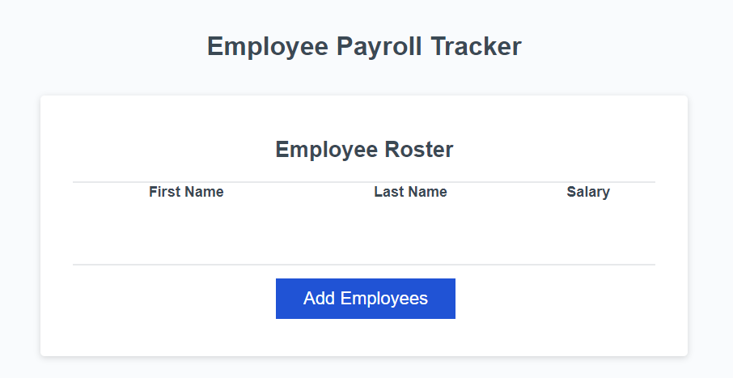

# <employee-payroll-tracker>

## Description

This tracker will allow an employer to track the employees' payroll and also show the average salary and allow for a randomly selected winner.

## Installation

N/A

## Usage

Deployed: https://gwiyomiamy.github.io/employee-payroll-tracker/

Click the "Add Employees" button and follow the prompts to add first name, last name, and salary. Open the console to see average salary and also the randomly selected winner.

Provide instructions and examples for use. Include screenshots as needed.

    ```md
    
    ```

## Credits

N/A
## How to Contribute

If you created an application or package and would like other developers to contribute it, you can include guidelines for how to do so. The [Contributor Covenant](https://www.contributor-covenant.org/) is an industry standard, but you can always write your own if you'd prefer.

## Tests

Go the extra mile and write tests for your application. Then provide examples on how to run them here.
